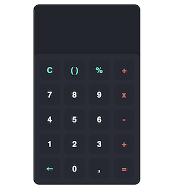

# Web Calculator
A simple calculator built using HTML, CSS, and JavaScript.

## Features
Basic arithmetic operations: addition, subtraction, multiplication, and division
Parentheses for grouping expressions
Percentage operator
Clear button to reset the input
Backspace button to delete the last input
Decimal point button to add a decimal point to the input

## Usage
To use the calculator, simply click on the buttons to input numbers and perform calculations. The calculator can perform basic arithmetic operations such as addition, subtraction, multiplication, and division. You can also use parentheses to group expressions together, and use the modulo operator to find the remainder of a division operation.

To clear the input, click on the "C" button. To delete the last input, click on the "<-" button. To take percentage of the input, click on the "%" button. To add a decimal point to the input, click on the "," button.

## Development
The calculator is built using HTML, CSS, and JavaScript. The main logic for the calculator is in the script.js file, which defines a function button that handles button clicks and updates the input accordingly. The style.css file contains the styling for the calculator.

To run the calculator locally, simply open the index.html file in your web browser. You can also modify the HTML, CSS, and JavaScript files to customize the calculator as needed.
Or Here is the link to try immediately :arrow_right:  [Web Calculator]( https://cyuzbas.github.io/WebCalculator/) 

 ## Further Improvements
 - Adjust screen in case of overflows 
